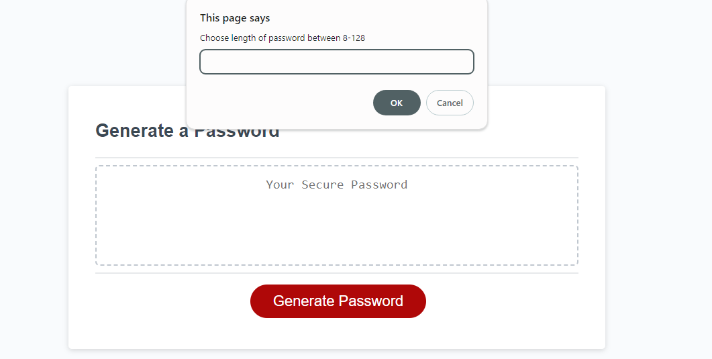
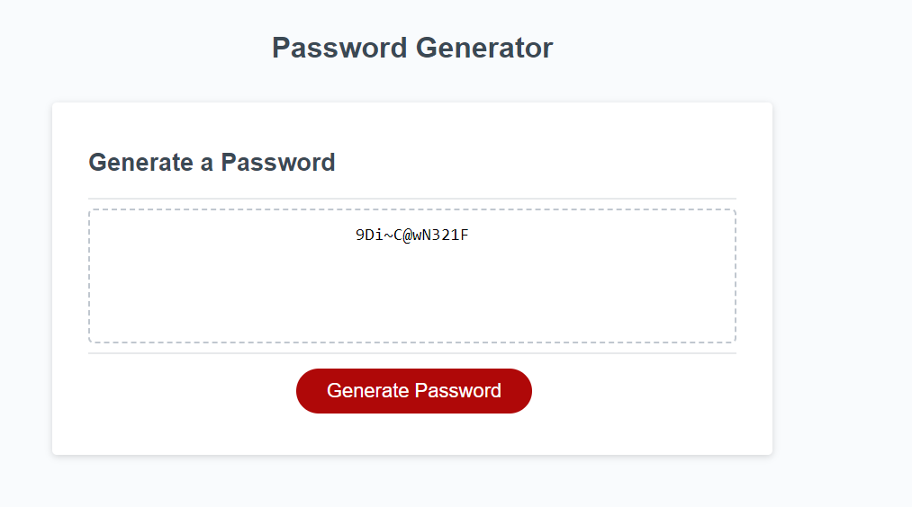

# Password-Generator
My own built password generator 
Link to Webpage: https://josh484.github.io/Password-Generator/
## Description 
This website is a password generator that when the user clicks the button on the middle of the page the user will be met with a series of prompts detailing what structure the password will have and then outputting the password within the textbox. This project highlights my understanding of the basics of javaScript using varoius types of variables, loops, functions and methods.

At the end of this project I am more confident in my use of javaScript. 
## Installation
In order to install the project simply click the green code button and download the file as a zip. 
Once downloaded simply right click on the file and unzip the folder.
## Usage 
Once the file is downloaded you can open the index.html on your web browser you will be met with this page:
.
Press the generate password button and you will be met with a series of prompts
.
Fill the prompts out and you will then have you're desired random password
.
## Features
This is the features of my password generator javaScript

- First I created 5 global variables, 4 for checking if the user wants to have a specific password option and the last one checks how long the user wants their password to be.

- The function getPasswordOptions creates the prompts for the user. Do while statement where prompt to get password length is repeated while character lenth is not a numebr between 8-128. 
Next a series of prompts that calls the function promptCheck for each type of character like numbers and lowercase. Makes sure the user presses y or n for the type of characters they want. 

- The function getRandom generates a random number within the size of the array and returns that random number. 

- The function generatePassword. Firstly creates a do While statment on generatePasswordOptions function where if none of the 4 global variables are not chosen within their prompts it repeats the prompts again.
Secondly, if the global variables for each character type is chosen(true) than push that into a new array that includes all the chosen characters.
Lastly, using the global variable for the length of the password loop through that and using the getRandom function get a random character within the array of chosen characters and add that to a new password string.
It then returns the newly created password.

- The last few functions are for the button and when the button is pressed calls the generatePassword function to start the prompts and generates password. 
